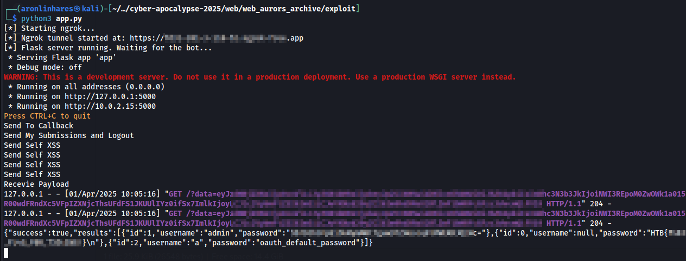

# Aurors Archive

> Hidden within the vibrant streets of Eldoria lies a marketplace of legends. Here, relics and enchanted tomes whisper tales of bygone eras, waiting for those daring enough to claim them. Navigate a vast archive of mystical artifacts using an intuitive filtering system that reveals treasures by era, elemental power, and more. Bid with your hard-earned Eldorian Gold in real time against fellow adventurers, each bid unlocking secrets that could alter your quest for the Dragon’s Heart. Every win unveils a fragment of Eldoria’s storied past, fusing ancient magic with modern strategy. In this dynamic realm, your choices echo through the annals of history—will you seize the relics that reshape destiny, or let them slip into legend?

**Difficulty:** Hard  
**Source Code:** Provided  
**Techniques used:** Self-XSS with Cookie Tossing and PostgreSQL `SQLi` to `RCE` (without using `;`)

This was the last one, and it took me all day and night. I started on Tuesday at 8 AM and only submitted the flag by Wednesday at 5 AM. To give you an idea, there were only 4 hours left before the CTF ended.

Although it was the hardest challenge, it was also the most fun — and definitely my favorite.

So, the challenge had two main applications: a Node-based web app (with a bot that visits any URL while logged in as admin after `/submissions` is triggered), and an OAuth server.

At first, I discovered a `SQLi` in an endpoint called `/table` inside `challenge/routes/admin.js`:
```javascript
// New Endpoint: Get all records from a specified table (POST version)
router.post("/table", isAdmin, async (req, res) => {
  const { tableName } = req.body;
  try {
    const query = `SELECT * FROM "${tableName}"`;

    if (query.includes(';')) {
      return res
        .status(400)
        .json({ success: false, message: "Multiple queries not allowed!" });
    }

    const results = await runReadOnlyQuery(query);
    res.json({ success: true, results });
  } catch (error) {
    console.error("Table Query Error:", error);
    res.status(500).json({
      success: false,
      message: "Error fetching table data.",
    });
  }
});
```

And this time, the middleware actually works as it should:
```javascript
// Middleware: Check if user is admin
async function isAdmin(req, res, next) {
  // This middleware expects that a previous middleware (in views.js) has set req.session.username
  if (!req.session.userId || req.session.username !== "admin") {
    return res
      .status(403)
      .json({ success: false, message: "Forbidden: Admins only" });
  }
  next();
}
```

Since only the admin can trigger the `RCE` and the app has a bot, that means, once again, we’ll need an `SSRF`. But this time, things get a bit more complex.

I only found two possible `XSS` injection points in the following files:
1. `challenge/views/auction_details.html`
2. `challenge/viesw/my_submissions.html`

The first one limited the payload to just 10 characters, as you can see in `challenges/routes/api.js`
```javascript
router.post('/auctions/:id/bids', isAuthenticated, async (req, res) => {
  try {
    const auctionId = req.params.id;
    const userId = req.session.userId;
    const { bid } = req.body;

    if (bid.length > 10) {
      return res.status(400).json({ success: false, message: 'Too long' });
    }
    await placeBid(auctionId, userId, bid);
    return res.json({ success: true });
  } catch (err) {
    console.error('Error placing bid:', err);
    const status = err.message.includes('Invalid') ? 400
                  : (err.message.includes('not found') || err.message.includes('closed')) ? 404
                  : 500;
    return res.status(status).json({ success: false, message: err.message || 'Internal server error.' });
  }
});
```

And the second one show my own submissions. Again, if I send it to the admin, they’ll see their own submissions, not mine.

After some time thinking about what could be done, I figured out a way to control what the bot would access — though, at that point, that was the only thing I had figured out.

To make this clearer, let’s take a quick look at `How OAuth servers work`:

---
### What is an OAuth Server?

An **OAuth Server** is responsible for authenticating users and authorizing third-party applications to access resources **on their behalf — without exposing their passwords**.

### How it works:
1. A user tries to access a third-party app (e.g., a calendar app that wants to access your Google Calendar).
2. The app redirects the user to the **OAuth Server** (e.g., Google’s login system).
3. The user logs in and **grants permission** to the app to access specific data.
4. The OAuth Server issues an **access token**.
5. The app uses this token to access the authorized resources **on behalf of the user**.

> All generate by my buddy Gpeto (a.k.a. ChatGPT)
---

So, basically, the client sends a request to the OAuth server asking for permission to access some user information. The OAuth server will then prompt the user to enter their username and password. If the user consents to share their data with the client, the OAuth server returns a code. The client then uses this code to confirm the authentication with the OAuth server.

Perfect. My first idea was to create a user on the OAuth server, initiate a login request to the web application, and then send the authorization code to the bot, so the bot would authenticate as me. Crazy, huh?

Sure, this way we’d be able to trigger the `XSS`, but the bot would be logged in as me (or the user we created), and not as admin... that gets us nowhere.

That left me stuck until I stumbled on something that changed the game completely.

After a few hours of research, I came across a great blog post on the Snyk site, [_Hijacking OAUTH flows via Cookie Tossing_](https://snyk.io/pt-BR/articles/hijacking-oauth-flows-via-cookie-tossing/) written by Elliot Ward. There's also an excellent [YouTube video](https://www.youtube.com/watch?v=xLPYWim60jA) by Thomas Houhou demonstrating the exploit in more detail, covering both Self-XSS and Cookie Tossing.

So the idea is to inject our own `connect.sid` cookie with `Path=/my-submissions`. That way, when the bot (logged in as admin) accesses `/my-submissions`, the browser will use **our** session and trigger the `XSS`. But when the bot navigates to other paths like `/table`, the browser will fall back to the **real** admin session.

And everything started to make sense. All I needed to do was:
1. Send my authorization code to the bot
2. Make it access `/my-submissions` to trigger the `XSS`
3. Perform cookie tossing to inject my own `connect.sid` with `Path=/my-submissions`
4. Force the bot to log out
5. Then make it access `/my-submissions` again, but this time, use the `XSS` to send a request that exploits the `SQLi` in `/table`

Sounds easy, right? Haha, nope. I had never heard of Cookie Tossing before. Learning about the technique and actually pulling it off was awesome — that’s exactly why I love CTFs.
Anyway, back to the challenge.

At this point, I was feeling pretty confident — I thought it would just be a matter of exploiting the `SQLi` and grabbing the final flag. But of course, I was wrong. I initially overlooked a small detail: the `;` validation in the code:
```javascript
// New Endpoint: Get all records from a specified table (POST version)
router.post("/table", isAdmin, async (req, res) => {
  const { tableName } = req.body;
  try {
    const query = `SELECT * FROM "${tableName}"`;

    if (query.includes(';')) {
      return res
        .status(400)
        .json({ success: false, message: "Multiple queries not allowed!" });
    }

    const results = await runReadOnlyQuery(query);
    res.json({ success: true, results });
  } catch (error) {
    console.error("Table Query Error:", error);
    res.status(500).json({
      success: false,
      message: "Error fetching table data.",
    });
  }
});
```

It was almost midnight, and there I was trying to send two SQL commands to PostgreSQL **without using a `;`**.

Then I stumbled upon an amazing post by `@adeadfed`: [_PostgreSQL SELECT-only RCE_](https://adeadfed.com/posts/postgresql-select-only-rce/). That post had everything I needed to make the exploit work. But... it was very late, and I was very sleepy. I had to re-read parts of it multiple times just to process it properly.

The core idea is to override `postgresql.conf` using a custom payload uploaded through PostgreSQL's `lo` (large object) functions.

To do that, we’ll use the following C code:
```c
#include <stdio.h>
#include <stdlib.h>
#include <string.h>

#include "postgres.h"
#include "fmgr.h"

#ifdef PG_MODULE_MAGIC
PG_MODULE_MAGIC;
#endif

__attribute__((constructor)) void run_on_load() {
    FILE *fp = popen("/readflag", "r");
    if (!fp) return;

    char flag[256] = {0};
    if (fgets(flag, sizeof(flag) - 1, fp)) {
        flag[strcspn(flag, "\n")] = 0; // remove newline
    }
    pclose(fp);

    if (strlen(flag) == 0) return;

    // build the curl command
    char cmd[512];
    snprintf(cmd, sizeof(cmd),
        "echo '%s' > /tmp/flag",
        flag);

    system(cmd);
}
```
> This code was generated by Gpeto. Initially, I wanted to send the flag via `curl` to my ngrok server, but since it was already late, I just modified it to copy the flag to `/tmp`.

I compiled the code using the following command:
`gcc -I$(pg_config --includedir-server) -shared -fPIC -nostartfiles -o payload.so payload.c`

I used Docker to do this.
>**Note:** It was necessary to install the `postgresql-dev` package. You can do the same with: `apk add postgresql-dev`

Then I created a Python script to do the work to me:
Here’s the full flow:
1. Start a server to receive the admin’s password.
2. Send my authorization code to the bot.
3. Trigger the `/my-submissions` endpoint to fire the XSS.
4. Perform cookie tossing by setting my own `connect.sid` with `Path=/my-submissions`.
5. Force the bot to log out.
6. Trigger `/my-submissions` again, this time the `XSS` executes with the admin's real session, allowing me to exploit the `SQLi` via `/table` and exfiltrate the `users` table back to my server.
7. Log in to the application as admin.
8. Upload the `postgresql.conf` file via `/table`.
9. Upload the `payload.so` shared object via `/table`.
10. Run `pg_reload_conf()` via `/table` to load the malicious config.
11. Finally, read the flag using `pg_read_file('/tmp/flag')`.

And tadaa — the flag was successfully retrieved:


>**Note:** I missed the timing to write the write-ups and the after party is over, so the challenge is now running locally on my machine.  
>But I swear it works, really works.
>
> **Note Two:** The Python code is massive, so I didn’t include it here. But feel free to check it out [here](exploits/app.py)
