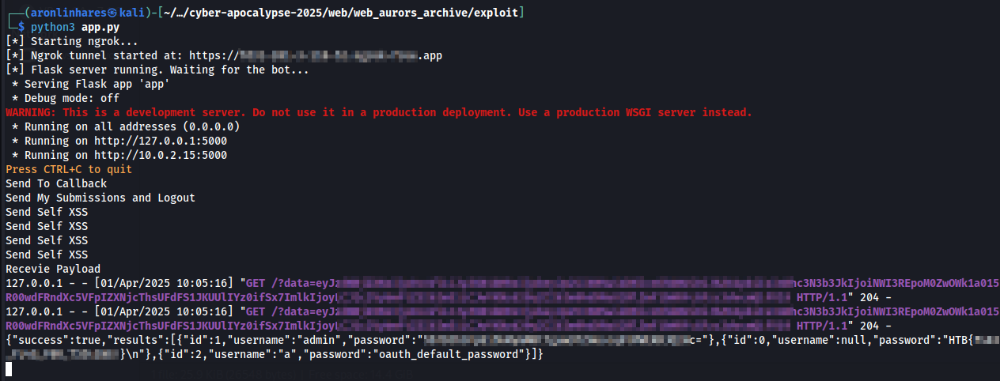

# Aurors Archive

> Hidden within the vibrant streets of Eldoria lies a marketplace of legends. Here, relics and enchanted tomes whisper tales of bygone eras, waiting for those daring enough to claim them. Navigate a vast archive of mystical artifacts using an intuitive filtering system that reveals treasures by era, elemental power, and more. Bid with your hard-earned Eldorian Gold in real time against fellow adventurers, each bid unlocking secrets that could alter your quest for the Dragon’s Heart. Every win unveils a fragment of Eldoria’s storied past, fusing ancient magic with modern strategy. In this dynamic realm, your choices echo through the annals of history—will you seize the relics that reshape destiny, or let them slip into legend?

**Dificuldade:** Difícil  
**Código-fonte:** Fornecido  
**Técnicas utilizadas:** Self-XSS com Cookie Tossing e `SQLi` em PostgreSQL para RCE (sem usar `;`)

Esse foi o último desafio e me tomou o dia inteiro e a noite. Comecei na terça-feira às 8h da manhã e só entreguei a flag na quarta às 5h da manhã. Pra você ter uma ideia, restavam apenas 4 horas para o CTF acabar.

Apesar de ter sido o mais difícil, também foi o mais divertido e com certeza o meu favorito.

O desafio tinha duas aplicações principais: uma aplicação web em Node (com um bot que visita qualquer URL logado como admin quando `/submissions` é chamado) e um servidor OAuth.

De cara, descobri uma `SQLi` em um endpoint chamado `/table`, no arquivo `challenge/routes/admin.js`:
```javascript
// New Endpoint: Get all records from a specified table (POST version)
router.post("/table", isAdmin, async (req, res) => {
  const { tableName } = req.body;
  try {
    const query = `SELECT * FROM "${tableName}"`;

    if (query.includes(';')) {
      return res
        .status(400)
        .json({ success: false, message: "Multiple queries not allowed!" });
    }

    const results = await runReadOnlyQuery(query);
    res.json({ success: true, results });
  } catch (error) {
    console.error("Table Query Error:", error);
    res.status(500).json({
      success: false,
      message: "Error fetching table data.",
    });
  }
});
```

E dessa vez, o middleware realmente funcionava como deveria:
```javascript
// Middleware: Check if user is admin
async function isAdmin(req, res, next) {
  // This middleware expects that a previous middleware (in views.js) has set req.session.username
  if (!req.session.userId || req.session.username !== "admin") {
    return res
      .status(403)
      .json({ success: false, message: "Forbidden: Admins only" });
  }
  next();
}
```

Como apenas o admin pode acionar o `RCE` e a aplicação possui um bot, isso significa que, mais uma vez, precisaríamos de um `SSRF`. Mas dessa vez, a coisa era mais complexa.

Eu encontrei apenas dois possíveis pontos de `XSS` nos seguintes arquivos:
1. `challenge/views/auction_details.html`
2. `challenge/views/my_submissions.html`

O primeiro limitava o payload a apenas 10 caracteres, como visto em `challenges/routes/api.js`:
```javascript
router.post('/auctions/:id/bids', isAuthenticated, async (req, res) => {
  try {
    const auctionId = req.params.id;
    const userId = req.session.userId;
    const { bid } = req.body;

    if (bid.length > 10) {
      return res.status(400).json({ success: false, message: 'Too long' });
    }
    await placeBid(auctionId, userId, bid);
    return res.json({ success: true });
  } catch (err) {
    console.error('Error placing bid:', err);
    const status = err.message.includes('Invalid') ? 400
                  : (err.message.includes('not found') || err.message.includes('closed')) ? 404
                  : 500;
    return res.status(status).json({ success: false, message: err.message || 'Internal server error.' });
  }
});
```

E o segundo mostrava apenas minhas submissões. Ou seja, se eu enviasse isso ao admin, ele veria as próprias submissões, não as minhas. Por causa da sessão.

Depois de um tempo quebrando a cabeça, encontrei uma forma de controlar o que o bot acessaria. Embora, naquele momento, fosse só isso que eu tinha.

Pra deixar tudo mais claro, aqui vai um rápido resumo sobre como funcionam servidores OAuth:

---
### O que é um Servidor OAuth?

Um **Servidor OAuth** é responsável por autenticar usuários e autorizar aplicativos de terceiros a acessarem recursos **em nome do usuário — sem expor sua senha**.

### Como funciona:
1. O usuário tenta acessar um app de terceiros (ex: um app de calendário querendo acessar o Google Calendar).
2. O app redireciona o usuário para o **Servidor OAuth** (ex: login do Google).
3. O usuário faz login e **concede permissão** ao app para acessar certos dados.
4. O servidor OAuth emite um **token de acesso**.
5. O app usa esse token para acessar os recursos autorizados **em nome do usuário**.

> Tudo gerado pelo meu amigo Gpeto (vulgo ChatGPT)
---

Então basicamente, o cliente faz uma requisição ao servidor OAuth pedindo permissão para acessar dados do usuário. O servidor OAuth solicita o login do usuário e, se o usuário consentir, retorna um código de autorização. O cliente então usa esse código para confirmar a autenticação com o servidor.

Perfeito. Minha primeira ideia foi criar um usuário no servidor OAuth, iniciar o login na aplicação web e enviar o meu código para o bot, assim, o bot estaria autenticado como eu. Loucura, né?

Claro, com isso eu conseguiria disparar o `XSS`, mas o bot estaria logado como eu (ou o usuário que criei), e  não como Admin... isso não ajudava em nada.

Fiquei travado até que encontrei algo que mudou tudo.

Depois de algumas horas de pesquisa, encontrei um excelente post no site da Snyk: [_Hijacking OAUTH flows via Cookie Tossing_](https://snyk.io/pt-BR/articles/hijacking-oauth-flows-via-cookie-tossing/) do Elliot Ward. Também tem um [vídeo no YouTube](https://www.youtube.com/watch?v=xLPYWim60jA) feito pelo Thomas Houhou demonstrando o ataque com mais detalhes.

A ideia é injetar nosso próprio cookie `connect.sid` com `Path=/my-submissions`. Assim, quando o bot (logado como admin) acessa `/my-submissions`, o navegador usará nossa sessão e executará o `XSS`. Mas quando o bot navegar para outros caminhos, como `/table`, o navegador usará a sessão do admin.

E tudo começou a fazer sentido. Eu só precisava:
1. Enviar meu código de autorização para o bot
2. Fazer o bot acessar `/my-submissions` para disparar o `XSS`
3. Realizar o cookie tossing com meu `connect.sid` (Path=`/my-submissions`)
4. Forçar o bot a fazer logout
5. Fazer o bot acessar `/my-submissions` novamente, mas dessa vez usar o `XSS` para explorar a `SQLi` no endpoint `/table`

Parece fácil, né? Haha, não. Eu nunca tinha ouvido falar de Cookie Tossing antes. Aprender essa técnica e conseguir explorar foi incrível. É por isso que eu amo CTFs.
Voltando ao desafio:

Eu tava me sentindo confiante, achei que seria só explorar a `SQLi` e correr pro abraço. Mas, claro, eu estava errado. Inicialmente, não percebi essa pequena verificação: A validação do `;` na query.
```javascript
// New Endpoint: Get all records from a specified table (POST version)
router.post("/table", isAdmin, async (req, res) => {
  const { tableName } = req.body;
  try {
    const query = `SELECT * FROM "${tableName}"`;

    if (query.includes(';')) {
      return res
        .status(400)
        .json({ success: false, message: "Multiple queries not allowed!" });
    }

    const results = await runReadOnlyQuery(query);
    res.json({ success: true, results });
  } catch (error) {
    console.error("Table Query Error:", error);
    res.status(500).json({
      success: false,
      message: "Error fetching table data.",
    });
  }
});

```

Já era quase meia-noite e eu tentando executar dois comandos SQL **sem usar `;`**.

Foi aí que encontrei um post sensacional do `@adeadfed`: [_PostgreSQL SELECT-only RCE_](https://adeadfed.com/posts/postgresql-select-only-rce/). Esse post tinha exatamente o que eu precisava. Mas já era tarde, eu tava com sono, e precisei reler algumas vezes até entender tudo.

A ideia é sobrescrever o `postgresql.conf` com um payload customizado usando funções `lo` (Large Object) do PostgreSQL.

O código em C usado foi esse:
```c
#include <stdio.h>
#include <stdlib.h>
#include <string.h>

#include "postgres.h"
#include "fmgr.h"

#ifdef PG_MODULE_MAGIC
PG_MODULE_MAGIC;
#endif

__attribute__((constructor)) void run_on_load() {
    FILE *fp = popen("/readflag", "r");
    if (!fp) return;

    char flag[256] = {0};
    if (fgets(flag, sizeof(flag) - 1, fp)) {
        flag[strcspn(flag, "\n")] = 0; // remove newline
    }
    pclose(fp);

    if (strlen(flag) == 0) return;

    // build the curl command
    char cmd[512];
    snprintf(cmd, sizeof(cmd),
        "echo '%s' > /tmp/flag",
        flag);

    system(cmd);
}
```

> Esse código foi gerado pelo Gpeto. A ideia era usar `curl` pra enviar a flag pro meu servidor ngrok, mas já tava tarde então só copiei a flag pra `/tmp` mesmo.

Compilei com:
`gcc -I$(pg_config --includedir-server) -shared -fPIC -nostartfiles -o payload.so payload.c`

Usei um container Docker pra isso.
> **Nota:** Foi necessário instalar o pacote `postgresql-dev`. Usei: `apk add postgresql-dev`

Depois, criei um script em Python pra automatizar tudo:
Fluxo completo:
1. Iniciar servidor para receber a senha do admin
2. Enviar código de autorização pro bot
3. Acessar `/my-submissions` pra disparar o `XSS`
4. Fazer cookie tossing com o `connect.sid`
5. Forçar logout do bot
6. Acessar `/my-submissions` novamente e explorar a `SQLi` em `/table` para acessar a tabela `users` e coletar a senha do admin e envia para o nosso servidor.
7. Logar como admin
8. Subir o `postgresql.conf`
9. Subir o `payload.so`
10. Executar `pg_reload_conf()`
11. Ler a flag com `pg_read_file('/tmp/flag')`

E tadá! Flag capturada com sucesso:


> **Nota:** Perdi o timing pra escrever os write-ups e a after party acabou, então estou rodando o desafio localmente.  
> Mas juro que funciona. De verdade.
>
> **Nota 2:** O código em Python é gigante, então não coloquei aqui. Mas pode conferir [aqui](exploit/app.py)